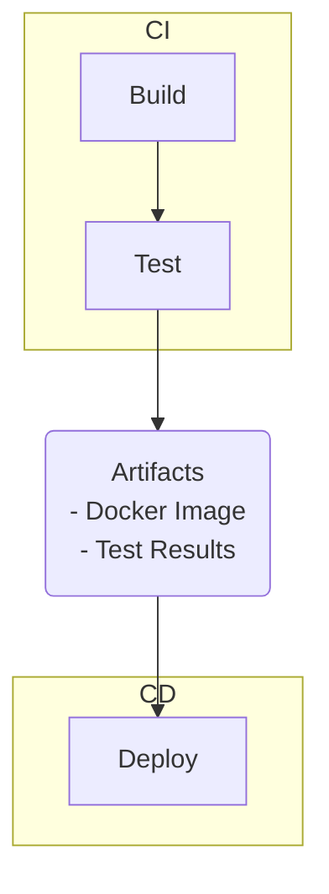

# ci_cd_workflow
Node.js Project to make a CI-CD Workflow using GitHub.

```mermaid
flowchart
    subgraph CI
        direction LR
        Build --> Test
    end
    Test --> A --> Deploy
    subgraph CD
        direction RL
        Deploy
    end
    A(Artifacts<br /> - Docker Image <br /> - Test Results)
```
